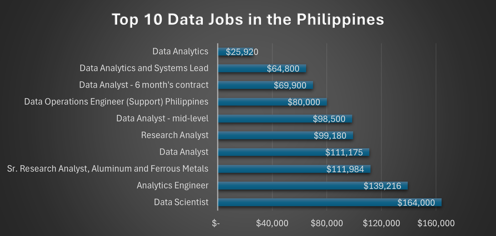
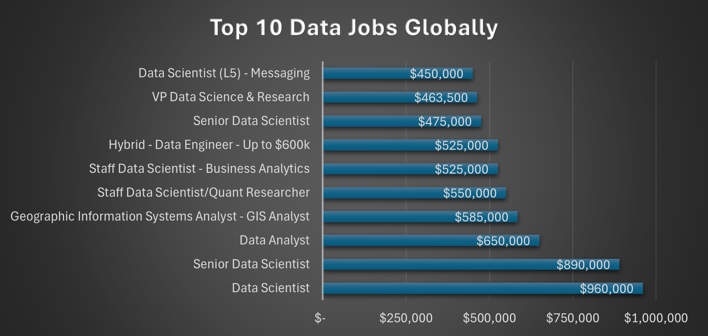
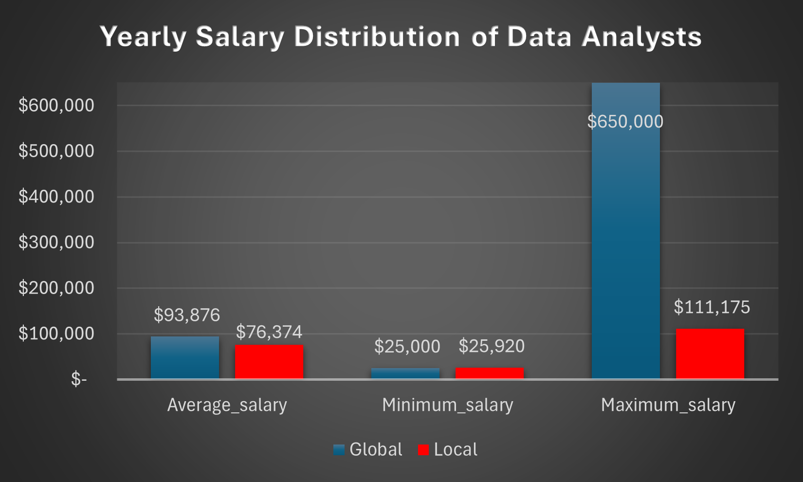
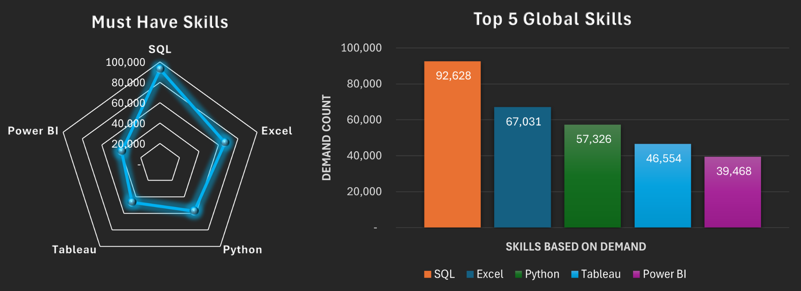
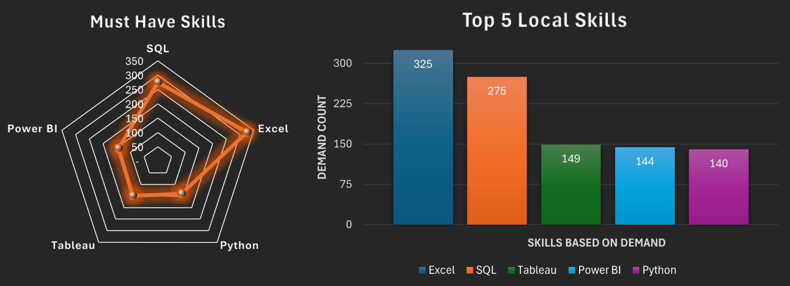
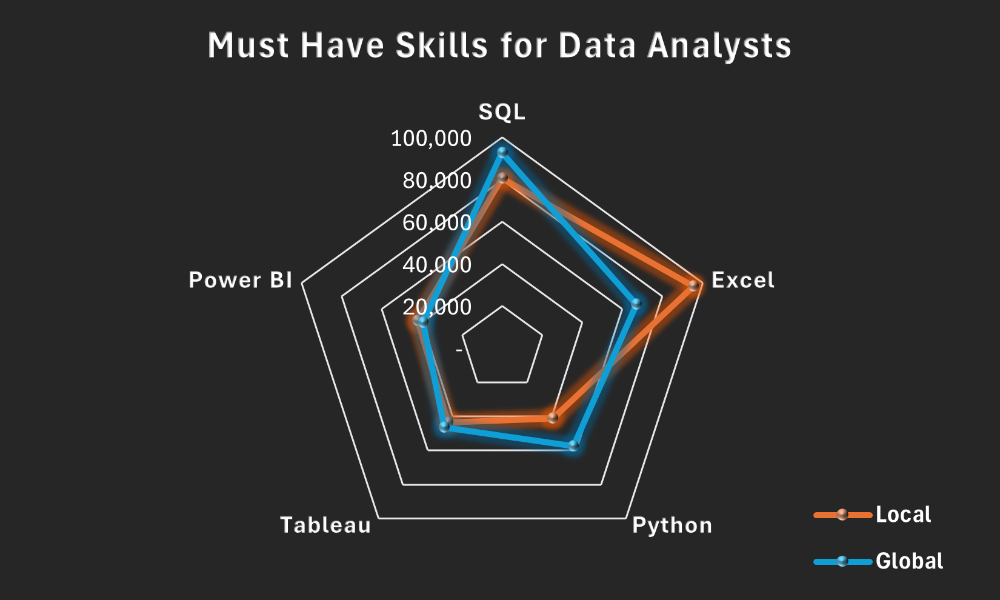
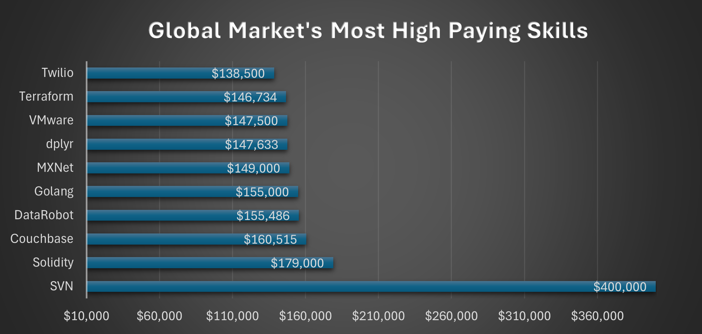

# Data Analyst Skills That Pay: A Demand vs. Salary Analysis of 2023 Job Postings
## Introduction
Everyone wants a high-paying job in data, but few can pinpoint exactly which skills the market is willing to pay a premium for. Is it **Python? SQL?** Or a niche combination of both? This analysis moves beyond job titles to look at the "market price" of expertise. Using a SQL-driven framework, we analyzed salary variances across locations and industries to solve a critical problem for the modern professional: 

**How do you strategically choose what to learn next?**

 The results offer a transparent look at the ROI of technical skills, revealing which paths lead to stagnation and which lead to the highest financial returns.


Wanna Check out the Queries 🤔? Access it here 😃:
[Queries_used](Queries)

## Objectives
<p style="text-align: justify;">
The objective of this project is to move beyond anecdotal career advice and establish a data-driven framework for navigating the 2023 data analyst job market. By applying statistical aggregation and filtering to real-world job postings and compensation data, this project aims to provide a clear roadmap for career progression and skill acquisition. More importantly, it seeks to answer the following questions:

#### 1. Which data roles offer the highest-paying job opportunities?
This identifies where the strongest compensation exists across data-related roles at both global and local levels.
#### 2. How does Data Analyst compensation differ between global and local markets?
This examines salary distribution, including minimum, average, and maximum earnings, to understand how career progression and earning potential vary by geography.
#### 3. What skills are most frequently required for Data Analyst roles?
This measures job market demand to identify the core technical skills employers consistently expect from Data Analysts in both global and Philippine markets.
#### 4. Which skills are associated with higher average salaries for Data Analysts?
This evaluates salary premiums to determine which technical skills provide stronger compensation leverage beyond basic employability.
#### 5. Which skills should Data Analysts prioritize to maximize both job demand and salary potential?
By combining market demand and average salary, this question identifies high-value skills that offer the best return on investment, distinguishing strategic, specialized, commodity, and low-priority skills.

## Methodology 
This project uses SQL as the primary tool to analyze a large dataset of job postings from 2023 and convert it into clear insights about the data analyst job market. The [dataset](https://drive.google.com/drive/folders/1KD5tZ1xcfKAIwO6uBV4Jz0n6d4NrmVoT?usp=sharing) contains information on 2023's job titles, companies, locations, salary data, and required skills. 
The analysis was conducted by building structured SQL queries that progressively narrow the data to match the goals of the project. Job postings were first filtered by role and location to allow fair comparisons between global and local markets. Salary data was then aggregated to measure average, minimum, and maximum compensation, providing a clear view of earning potential and career progression.
<p style="text-align: justify;">
To understand skill requirements, job postings were linked to their associated skills using relational joins. This made it possible to measure how often specific skills appear in data analyst roles (market demand) and how those skills relate to average salary outcomes (skill value). By combining these two measures, the project evaluates not just which skills are popular, but which ones are most strongly rewarded by the market.

## Tools 
<p style="text-align: justify;">

The primary aim of this project is to create a data-driven framework that connects roles, skills, and salary into a single, coherent view of the data analyst labor market. To do so, we also used the following tools: 

- SQL: Served as the primary analytical language. Used extensively for data filtering, aggregation, joins, window functions, CTEs, and derived metrics to uncover salary trends, skill demand, and valuation patterns.
- PostgreSQL: Used as the relational database management system to store and manage large-scale job posting data, used for efficient querying, indexing, and schema-based data modeling.
- Visual Studio Code: Used as the primary working environment for developing, testing, and organizing SQL queries in a clear and maintainable environment.
- Microsoft Excel : Used extensively for data visualization and creation of performance dashboards.
- Git & GitHub: Used for version control and documentation to track query iterations. Used as a platform to share output and as an avenue for future collaborations.
</p>

## Analysis
### 1. Highest-Paying Data Roles
We identified the top 10 highest-paying data roles at both global and local levels. We  then filter the results specifically for data analyst positions wherein **location and average annual salary** are the important key factors for being in the list. 
```
SELECT
    job_id,
    job_title,
    job_location,
    job_schedule_type,
    salary_year_avg,
    name AS company_name
FROM
    job_postings_fact
LEFT JOIN  company_dim ON job_postings_fact.company_id = company_dim.company_id
WHERE
    salary_year_avg IS NOT NULL
ORDER BY
    salary_year_avg DESC
LIMIT 10
```
#### Local Average Annual Salary of Top Paying Data Roles


- Advanced roles such as Data Scientist and Analytics Engineer dominate the local salary landscape.
- Data analyst compensation increases noticeably with seniority and role scope.
- Roles combining analytics with engineering or research depth consistently command higher salaries.
<p style="text-align: justify;">
Local market results show a clear salary gap between advanced data roles and traditional analyst positions. Data Scientist ($164,000) and Analytics Engineer ($139,216) roles command the highest average salaries, which shows a strong demand for modeling, engineering, and system-level skills. Among analyst roles, Data Analyst ($111,175) and mid-level Data Analyst ($98,500) positions remain competitive, while contract-based roles average significantly lower pay ($69,900), indicating a trade-off between stability and compensation. Research-focused roles fall in the mid-to-high range, suggesting domain expertise adds value, but the highest salary outcomes consistently align with roles that combine analytics with engineering or specialized technical responsibility.
</p>

#### Global Average Annual Salary of Top Paying Data Roles


- Global compensation for advanced data roles is an order of magnitude higher than local benchmarks.
- Senior and staff-level Data Scientist roles dominate the top salary tier.
- Executive and research-intensive roles earns the highest pay
- The global market strongly rewards scale, specialization, and leadership.
<p style="text-align: justify;">
Global market results show extreme salary concentration at the senior and executive levels, led by Data Scientist ($960,000) and Senior Data Scientist ($890,000) roles, far exceeding local compensation ceilings. Unlike the local market, where analytics and engineering roles are more evenly distributed, global top-paying positions are heavily skewed toward senior, staff, and leadership roles, including VP Data Science & Research ($463,500) and staff-level research positions. Even general Data Analyst roles reach significantly higher compensation globally ($650,000), highlighting the impact of market scale, company size, and regional pay structures. Overall, the global market places substantially greater monetary value on advanced specialization, organizational influence, and high-impact decision-making compared to the more role-balanced local landscape.
</p>

### 2. Local vs. Global Salary Compensation 
We analyzed salary distribution by computing minimum, maximum, and average earnings to understand market progression from entry-level roles to senior, high-compensation positions.
```
WITH global_data_analyst_jobs AS (
    SELECT
        job_id,
        salary_year_avg
    FROM job_postings_fact
    WHERE
        job_title_short = 'Data Analyst'
        AND salary_year_avg IS NOT NULL
)
SELECT
    COUNT(*) AS total_DA_jobs,
    ROUND(AVG(salary_year_avg), 0) AS avg_salary,
    MIN(salary_year_avg) AS min_salary,
    MAX(salary_year_avg) AS max_salary
FROM global_data_analyst_jobs;
```


- The global market offers a higher average salary and wider earning range than the local market.
- Local salaries show a narrower ceiling, limiting upside at senior levels.
- Entry-level compensation is comparable, but career progression diverges sharply.
- Global roles provide significantly greater long-term earning potential.
<p style="text-align: justify;">
Salary aggregation shows a clear divergence in earning trajectories between local and global markets. While entry-level salaries are relatively similar (Global min: $25,000; Local min: $25,920), the average global salary ($93,876) exceeds the local average ($76,374), indicating stronger mid-career compensation abroad. The most pronounced difference appears at the upper end of the market, where the global maximum salary reaches $650,000, compared to a local ceiling of $111,175. This gap suggests that while local markets can support early to mid-level data roles, high-compensation senior and leadership opportunities are disproportionately concentrated in the global market, reinforcing the importance of role scope, market scale, and organizational impact in long-term salary growth.
</p>

### 3. Skills in Demand
We constructed a relational data model linking job titles, companies, and required skills. Roles were then ranked in terms of skills in demand ```(demand_count)``` to reveal which industries and organizations place the highest monetary value on advanced analytical skill sets.
```
SELECT 
    skills,
    COUNT(skills_job_dim.job_id) as demand_count
FROM job_postings_fact
INNER JOIN skills_job_dim ON job_postings_fact.job_id = skills_job_dim.job_id
INNER JOIN skills_dim ON skills_job_dim.skill_id = skills_dim.skill_id
WHERE 
    job_title_short = 'Data Analyst'
GROUP BY skills
ORDER BY demand_count DESC
LIMIT 5;
```

- SQL and Excel form the foundational skill set across both global and local markets.
- The global market shows stronger demand for programming and visualization tools.
- The local market places relatively higher emphasis on spreadsheet and BI tools.
- Skill demand patterns are consistent, but depth and scale differ by market.




<p style="text-align: justify;">
The market penetration analysis highlights a stable core skill set for data analyst roles across regions. Globally, SQL (92,628) and Excel (67,031) dominate demand, followed by Python (57,326) and visualization tools such as Tableau (46,554) and Power BI (39,468), reflecting the need for scalable querying, automation, and data storytelling. 



In the local market, Excel (325) and SQL (275) remain the most frequently required skills, but demand is more evenly distributed among Tableau, Power BI, and Python, indicating a stronger focus on reporting and dashboard-driven analysis.
 


Overall, while both markets agree on foundational skills, the global market demonstrates greater emphasis on programmatic and scalable analytics, whereas the local market prioritizes accessible, business-facing tools.
</p>

### 4. Skills Compensation 
 Using the same relational data model, we ranked the skills in terms of Skills Compensation ```(average_yearly_salary)``` to reveal which industries and organizations place the highest monetary value on advanced analytical skill sets.
```
SELECT 
    skills,
    ROUND(AVG(salary_year_avg), 0) as avg_salary
FROM job_postings_fact
INNER JOIN skills_job_dim ON job_postings_fact.job_id = skills_job_dim.job_id
INNER JOIN skills_dim ON skills_job_dim.skill_id = skills_dim.skill_id
WHERE job_title_short = 'Data Analyst' 
AND salary_year_avg IS NOT NULL
GROUP BY skills
ORDER BY avg_salary DESC
LIMIT 10; 
```
- Globally, specialized and infrastructure-oriented skills command the highest salary compensation.
- High-paying global skills are often low-frequency but high-impact.
- Locally, salaries dominantly favor analytics platforms and core data tools.
- High demand skills does not always indicate high salary wages.



<p style="text-align: justify;">
Ranking skills in terms of salary reveals a sharp difference between the global and local skill markets. Globally, the highest salary leverage is associated with highly specialized or infrastructure-adjacent skills, such as SVN ($400,000), Solidity ($179,000), and Couchbase ($160,515), which appear infrequently but are tied to niche, high-impact roles. This indicates that global compensation strongly rewards scarcity and technical specialization. 
</p>


<p style="text-align: justify;">
In contrast, the local market’s top-valued skills, including Looker and BigQuery ($111,175) and PostgreSQL, Tableau, GitHub, and Snowflake ($98,500), are more closely aligned with core analytics workflows and enterprise reporting environments. Notably, foundational skills like SQL ($93,192) and Python ($84,200) remain valuable locally but do not command the same premium as specialized tools. Overall, the results show that while global markets reward rare, high-complexity skills, local markets place greater salary value on widely applicable analytics platforms that support business intelligence and decision-making.
</p>

### 5. Skills Priority
<p style="text-align: justify;">
To identify the skills that offer the best balance between job market demand and compensation, we applied a rule-based evaluation framework that compares each skill against overall market benchmarks.
<p style="text-align: justify;">
First, job postings were filtered to Data Analyst roles and linked to their associated skills and salary data. For each skill, two metrics were calculated:

1. ```demand_count```, representing how frequently the skill appears across job postings, and
2. ```average_yearly_salary```, representing the typical compensation associated with roles requiring that skill.
<p style="text-align: justify;">
Next, instead of using fixed or subjective cutoffs, we established dynamic thresholds based on the dataset itself. The average demand and average salary across all skills were computed and used as reference points. Each skill was then evaluated relative to these benchmarks, allowing performance to be assessed in a market-aware and unbiased way.
<p style="text-align: justify;">
Based on whether a skill falls above or below the average demand and salary thresholds, skills were classified into four categories:

 - **Strategic (High demand and High pay):** Skills that exceed the market average in both demand and compensation, indicating broad applicability and strong salary rewards.

- **Specialized (Low demand but High pay):** Skills with below-average demand but above-average salaries, reflecting niche expertise that commands premium compensation due to scarcity.

- **Commodity (High demand but Lower pay):** Widely required skills that exceed average demand but do not deliver above-average salary returns, suggesting strong employability but limited differentiation.

- **Low Priority (Low demand and Low pay):** Skills that fall below market averages on both metrics, offering limited demand and compensation benefits.
<p style="text-align: justify;">
To ensure statistical relevance, only skills appearing in more than five job postings were included. This approach avoids overemphasizing rare outliers while preserving meaningful market signals. By anchoring skill classification to dataset-wide averages, the framework objectively highlights which technical skills deliver the highest return on investment in terms of both employability and salary outcomes.
</p>

```
WITH skill_base AS (
    SELECT
        skills_dim.skill_id,
        skills_dim.skills,
        job_postings_fact.salary_year_avg
    FROM job_postings_fact
    INNER JOIN skills_job_dim
        ON job_postings_fact.job_id = skills_job_dim.job_id
    INNER JOIN skills_dim
        ON skills_job_dim.skill_id = skills_dim.skill_id
    WHERE job_postings_fact.job_title_short = 'Data Analyst'
    OR job_postings_fact.salary_year_avg IS NOT NULL
),
skill_stats AS (
    SELECT
        skill_id,
        skills,
        COUNT(*) AS demand_count,
        ROUND(AVG(salary_year_avg), 0) AS avg_salary
    FROM skill_base
    GROUP BY skill_id, skills
),
thresholds AS (
    SELECT
        AVG(demand_count) AS avg_demand,
        AVG(avg_salary) AS avg_salary
    FROM skill_stats
)
SELECT
    skill_stats.skills,
    skill_stats.demand_count,
    skill_stats.avg_salary,
    CASE
        WHEN skill_stats.demand_count >= thresholds.avg_demand
         AND skill_stats.avg_salary >= thresholds.avg_salary
            THEN 'Strategic'
        WHEN skill_stats.demand_count >= thresholds.avg_demand
         AND skill_stats.avg_salary < thresholds.avg_salary
            THEN 'Commodity'
        WHEN skill_stats.demand_count < thresholds.avg_demand
         AND skill_stats.avg_salary >= thresholds.avg_salary
            THEN 'Specialized'
        ELSE 'Low Priority'
    END AS skill_category
FROM skill_stats
CROSS JOIN thresholds
WHERE skill_stats.demand_count > 5
ORDER BY
        skill_stats.avg_salary DESC,
     skill_stats.demand_count DESC;
```
- High-paying skills in both markets are dominated by specialized, low-demand technologies.
- Salaries are driven more by scarcity than popularity.
- Local and global markets show strong overlap in specialized skill valuation.
- High demand alone does not guarantee high return on investment.
### Top Local Priority Skills 
| Skill        | Demand Count | Average Yearly Salary (USD) | Skill Category |
|--------------|--------------|-----------------------------|----------------|
| MongoDB      | 262          | 170,715                     | Specialized    |
| dplyr        | 21           | 160,667                     | Specialized    |
| Node.js      | 65           | 154,408                     | Specialized    |
| Cassandra    | 530          | 154,124                     | Specialized    |
| Solidity     | 10           | 153,640                     | Specialized    |
| Watson       | 32           | 152,844                     | Specialized    |
| CodeCommit   | 6            | 152,289                     | Specialized    |
| RShiny       | 29           | 151,611                     | Specialized    |
| Hugging Face | 37           | 148,648                     | Specialized    |
| Neo4j        | 124          | 147,708                     | Specialized    |

### Top Global Priority Skills 
| Skill         | Demand Count | Average Yearly Salary (USD) | Skill Category |
|---------------|--------------|-----------------------------|----------------|
| Debian        | 9            | 196,500                     | Specialized    |
| RingCentral   | 26           | 182,500                     | Specialized    |
| MongoDB       | 536          | 170,715                     | Specialized    |
| Lua           | 18           | 170,500                     | Specialized    |
| dplyr         | 110          | 160,667                     | Specialized    |
| Haskell       | 7            | 155,758                     | Specialized    |
| ASP.NET Core  | 12           | 155,000                     | Specialized    |
| Node.js       | 187          | 154,408                     | Specialized    |
| Cassandra     | 840          | 154,124                     | Specialized    |
| Solidity      | 59           | 153,640                     | Specialized    |
##### Access the full tables here: [Global](https://github.com/rpmesina/SQL_Job_Market_Analysis/blob/main/Results/5_holistic_global.csv) and [Local](https://github.com/rpmesina/SQL_Job_Market_Analysis/blob/main/Results/5_holistic_local.csv)

<p style="text-align: justify;">
Using the unified evaluation model, it shows that the highest salary outcomes are consistently driven by specialized skills with low market penetration in both local and global markets.
<p style="text-align: justify;">
Locally, technologies such as MongoDB, Node.js, Cassandra, and Solidity command average salaries exceeding $150,000 despite relatively limited demand, which indicates strong compensation premiums for niche expertise. A similar pattern appears globally, where skills like Debian, Lua, Haskell, and ASP.NET Core achieve comparable salary levels while remaining scarce. Notably, several skills, including MongoDB, dplyr, Node.js, Cassandra, and Solidity, appear in both markets, suggesting globally transferable specialization. 

Outside the Specialized category, skill outcomes are mainly influenced by how common and standardized a tool has become in the job market. Strategic skills sits second as the strongest position, with widely used technologies such as **Python, SQL, cloud platforms (AWS)**, and big data tools like Spark appearing across many roles while still maintaining strong salary outcomes.

 Commodity skills are heavily demanded but offer weaker salary leverage because they are expected baseline tools, including **Excel, Power BI, Tableau, and SQL Server**, which are essential for daily analytics work but rarely drive pay differentiation. Low Priority skills show limited demand and lower salary impact, often associated with niche utilities, legacy systems, or general-purpose tools that add minimal standalone value. Overall, these categories highlight that while popular tools support employability, only a subset consistently contributes to stronger compensation outcomes. Moreover, it reinforces the idea that salary growth is more strongly influenced by technical scarcity and complexity rathen than popularity .
</p>

## Key Takeaways
<p style="text-align: justify;">
Through this project, I learned how to build a complete SQL-based data analysis workflow from scratch, starting with creating a local PostgreSQL database, designing structured tables, and importing raw job market data. Using Visual Studio Code, I developed and refined SQL queries for data cleaning, aggregation, multi-table joins, and salary analysis, while applying CTEs and window functions to extract meaningful insights. I also gained hands-on experience troubleshooting data import issues, schema conflicts, and query errors, strengthening my problem-solving and debugging skills. I also learned to showcase my professional project through GitHub and control its version through Git. I also enhanced my data visualization skills using Microsoft Excel. 
<p style="text-align: justify;">
This project also strengthened my analytical forecasting abilities by training me to identify patterns, trends, and salary drivers across large job market datasets. I learned how to translate technical findings into practical, industry-relevant insights that support smarter career and business decisions. Through hands-on analysis, I ultimately developed a data-driven problem-solving mindset that makes me capable of approaching real-world challenges with structured reasoning and evidence-based solutions. Overall, this project strengthened my technical foundation in databases, SQL analytics, and data-driven decision-making.
</p>

## Conclusion
This project confirms that the highest-paying opportunities in the data job market concentrate in advanced and senior roles, particularly **Data Scientist and analytics roles that integrate engineering or research responsibilities**. While Data Analyst positions offer competitive compensation, the strongest salary outcomes consistently align with expanded technical responsibilities, higher-impact decision-making, and seniority, especially in global markets.

A clear compensation gap emerges between global and local Data Analyst roles. Global positions show significantly higher average and maximum salaries, reflecting broader market scale and stronger rewards for senior progression. **Local roles**, while comparable at entry levels, demonstrate tighter salary ranges and earlier ceilings, which **limits long-term earning potential** without role expansion or specialization.

From a skills perspective, employers consistently expect foundational analytics tools such as **SQL, Excel, Python, and business intelligence platforms** as essential tools for employability. However, higher salary leverage comes from specialized and less common technologies, where scarcity increases market value. These results indicate that Data Analysts professionals can maximize their career and compensations by establishing strong core skills. While in the long run, **there is a need for selectively upskilling in unique but high-impact skills** that extend beyond common reporting platforms to achieve high salary roles.
</p>